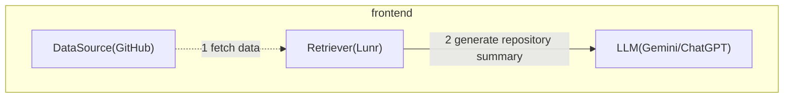
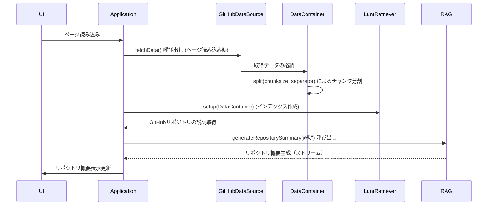
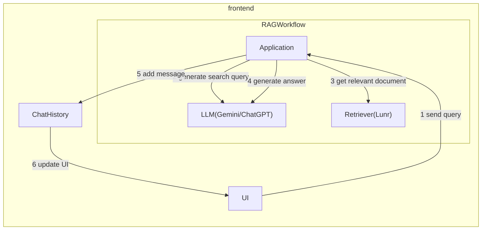
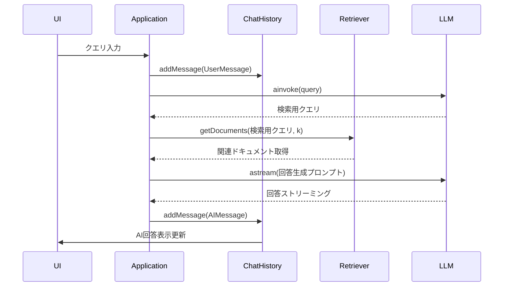
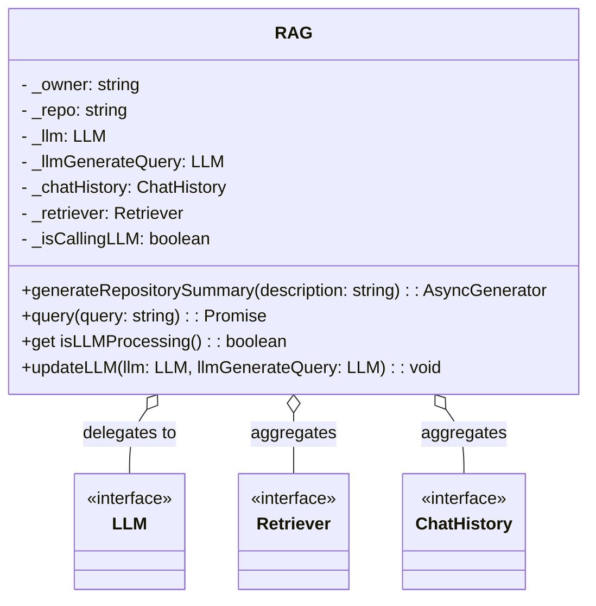
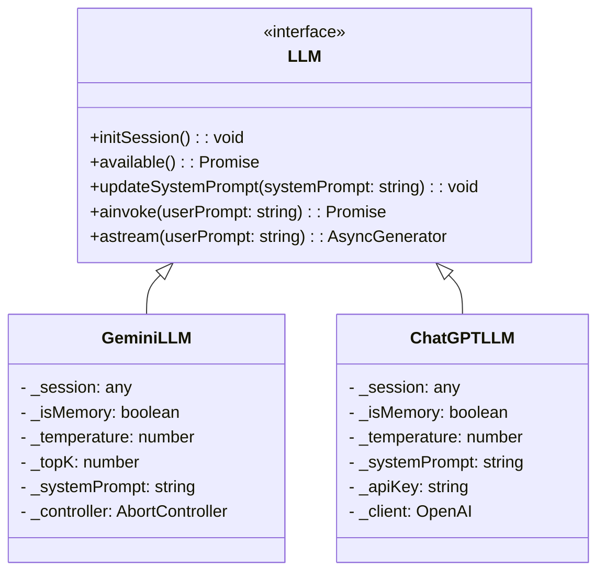
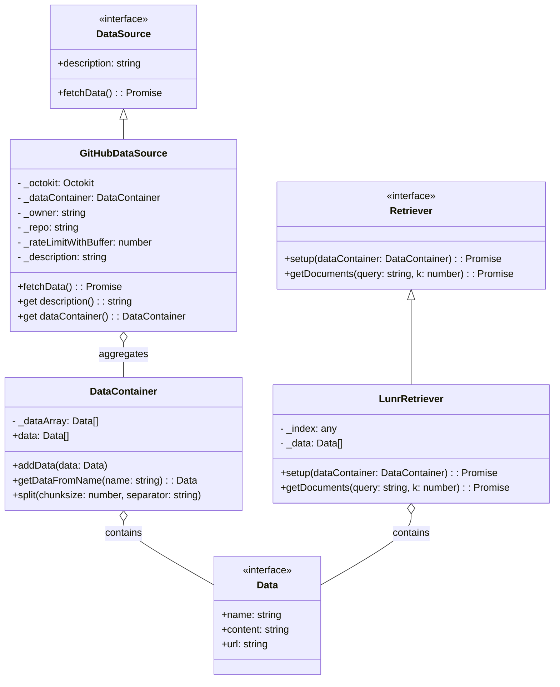
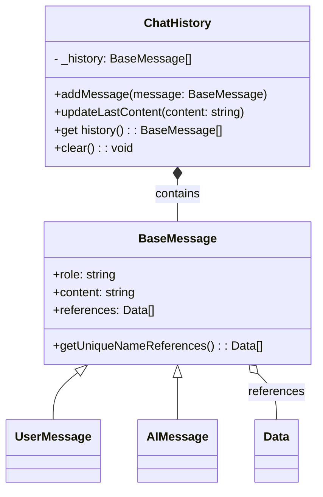
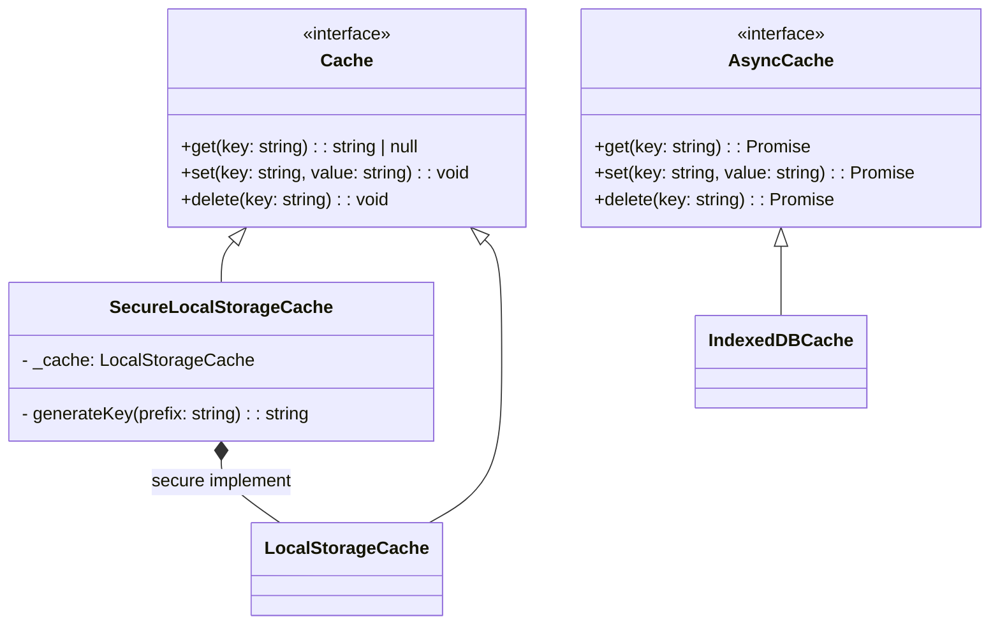

# giqhub architecture

## 概要

giqhubはシンプルなRAG（Retriever-Answer-Generator）アーキテクチャを採用しています。
RAGは、Retriever（検索エンジン）とLLM（回答生成器）を組み合わせたアーキテクチャで、検索した情報をもとに回答を生成することができます。

Retrieverは、フロントエンドで検索エンジンを提供し、検索結果を返します。

RAG用のRetrieverは、フロントエンドで完結する検索エンジンであるLunr( https://lunrjs.com/ )を使用しています。
LLMとしては、フロントエンドで動作するGemini Nano in Chrome( https://developer.chrome.com/docs/ai )を使用しています。

## フロー

giqhubの大まかな処理フローは以下の通りです。

### RAG用のRetrieverのセットアップ

ページ読み込み時に、GitHubのリポジトリ情報を取得し、Retrieverのセットアップを行います。その後、リポジトリの説明を取得し、リポジトリ概要表示を更新します。

より詳細なシーケンス図は以下の通りです。

### ユーザークエリ処理

ユーザーがクエリを入力すると、RAGはクエリを受け取り、検索用のクエリを生成します。Retrieverは検索用のクエリをもとに関連ドキュメントを取得し、LLMは関連ドキュメントをもとに回答を生成します。生成された回答はChatHistoryに追加され、UIに表示されます。

より詳細なシーケンス図は以下の通りです。

## クラス図

RAGアプリケーションをオーケストレーションするクラスとして、RAGクラスがあります。RAGクラスは、Retriever、LLM、ChatHistory、Retrieverを持ち、これらのクラスのファサードとして機能します。

LLMは、GeminiLLMとChatGPTの実装があります。GeminiLLMは、Gemini Nano in Chromeを使用して回答を生成します。ChatGPTは、OpenAIのChatGPTを使用して回答を生成します。

Retrieverは、LunrRetrieverとして実装されています。LunrRetrieverは、Lunrを使用して検索を行います。
RetrieverのDataを準備するためのクラスとして、DataSourceがあります。GitHubDataSourceは、GitHubのリポジトリ情報を取得します。

ChatHistoryは、ユーザーメッセージとAIメッセージを管理し、画面に表示するためのクラスです。ChatHistoryは、BaseMessageを継承したUserMessageとAIMessageを持ちます。

LLMやDataSourceへのアクセスをキャッシュするためのクラスとして、同期的にアクセスするCacheと、非同期的にアクセスするAsyncCacheがあります。Cacheは、LocalStorageCache、SecureLocalStorageCacheの2つの実装があります。AsyncCacheは、IndexedDBCacheの実装があります。

