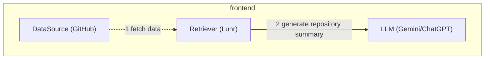
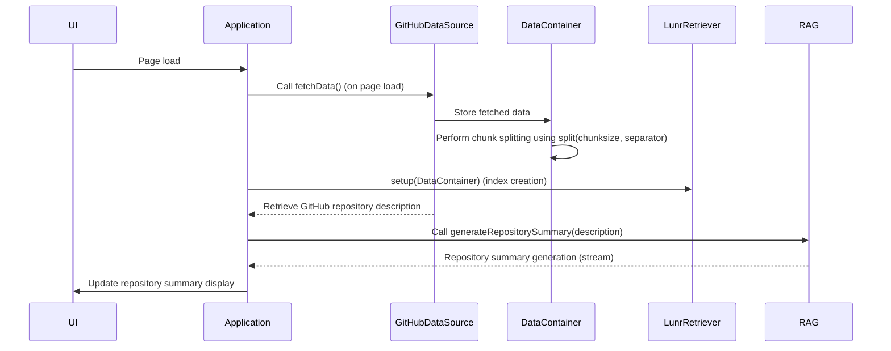
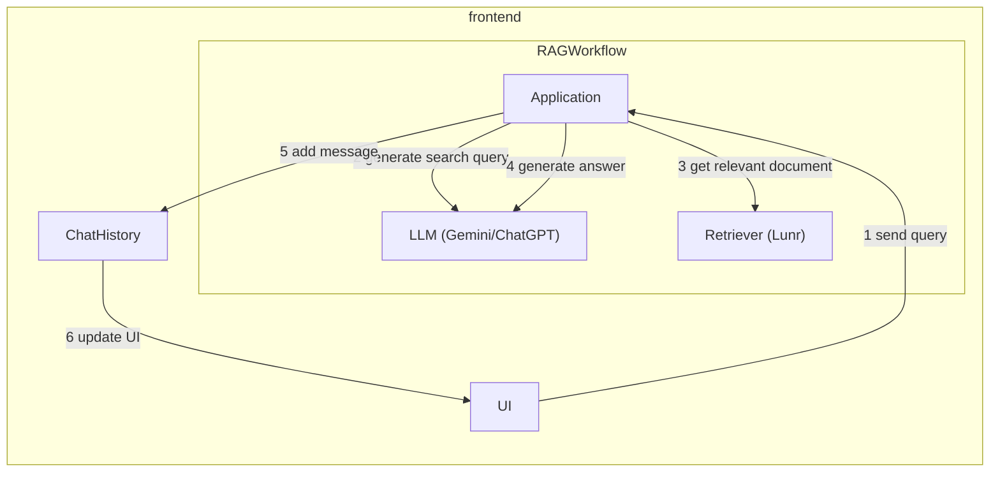
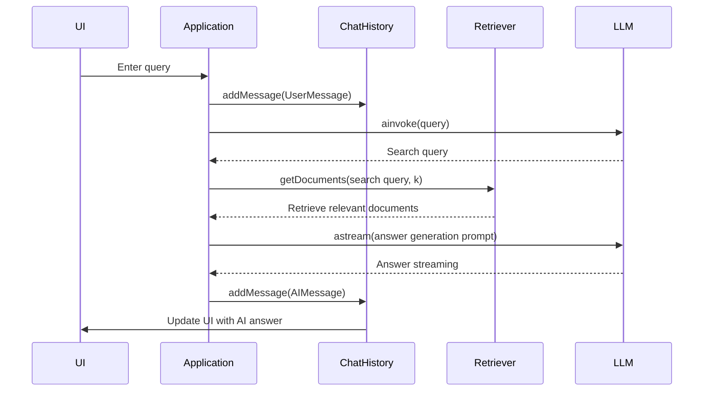
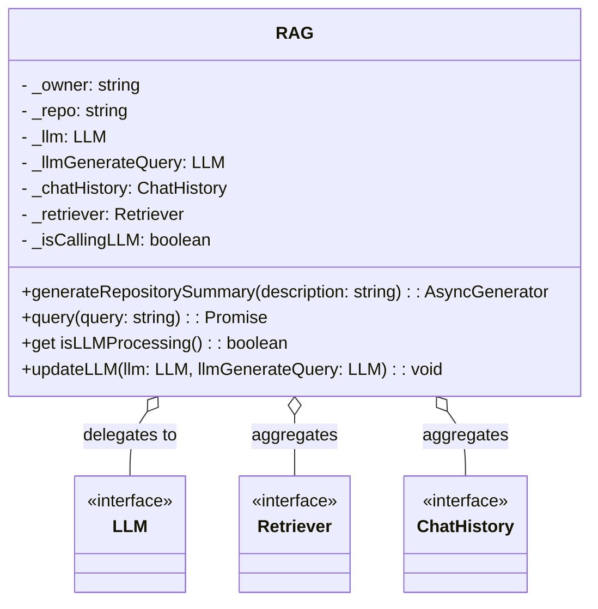
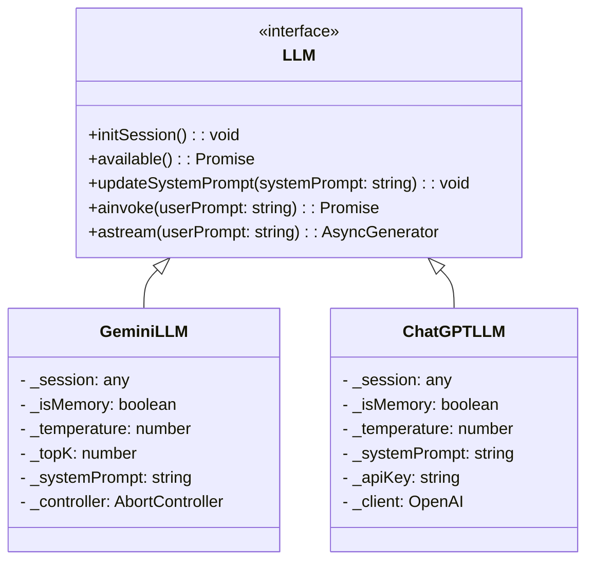
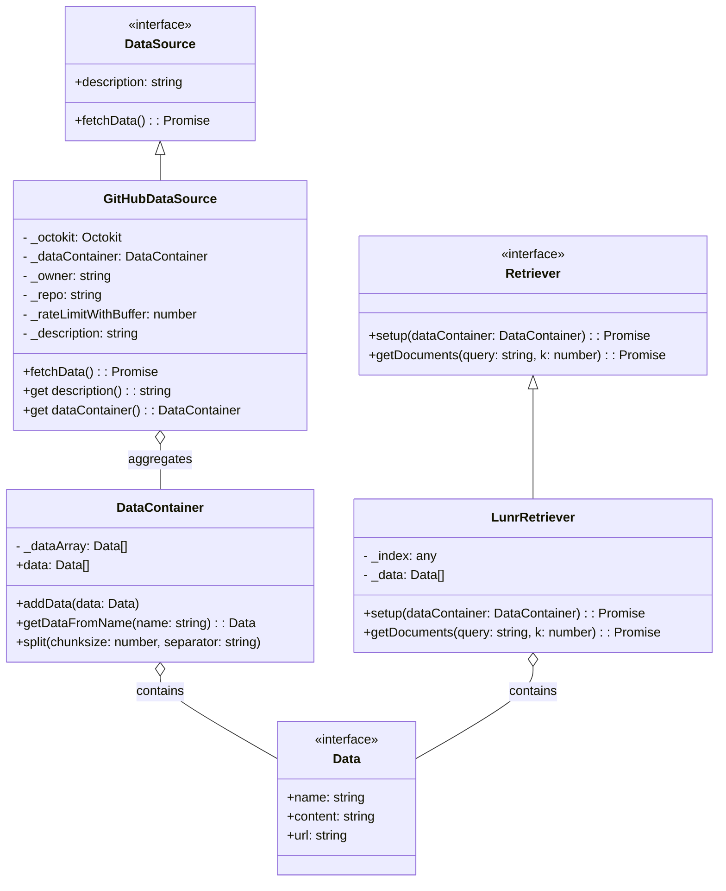
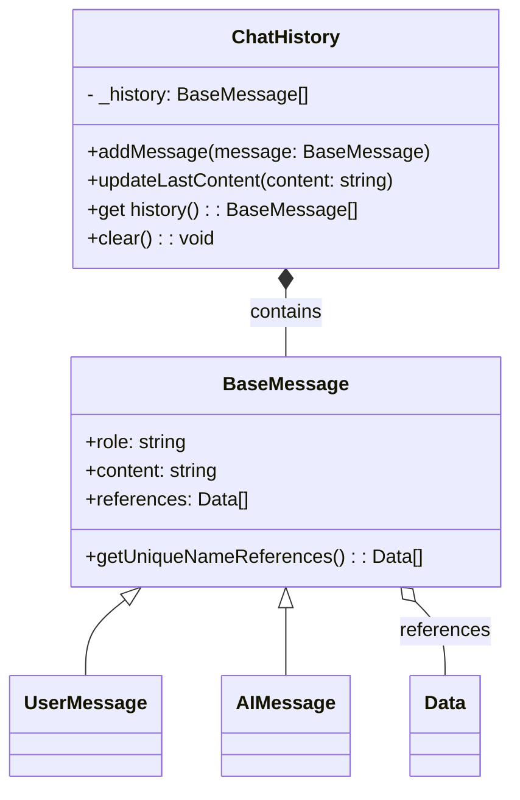
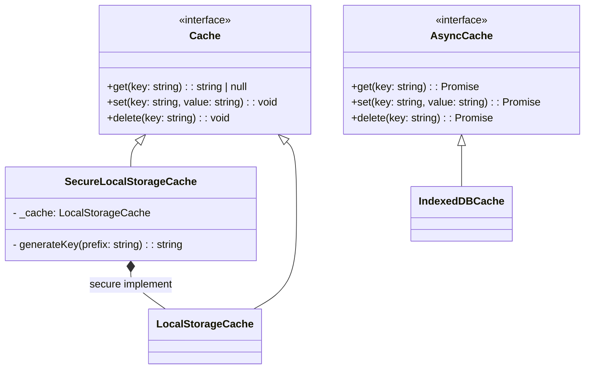

# giqhub Architecture

## Overview

giqhub adopts a simple RAG (Retriever-Answer-Generator) architecture.  
RAG is an architecture that combines a Retriever (search engine) with an LLM (answer generator) to produce answers based on retrieved information.

The Retriever provides a search engine on the frontend and returns search results.

For the RAG Retriever, we use Lunr ( https://lunrjs.com/ ), a search engine that runs entirely on the frontend.  
For the LLM, we use Gemini Nano in Chrome ( https://developer.chrome.com/docs/ai ), which also operates on the frontend.

## Flow

The overall processing flow of giqhub is as follows.

### Setup of the Retriever for RAG

When the page loads, the GitHub repository information is fetched and the Retriever is set up. Afterwards, the repository description is retrieved and the repository summary display is updated.

A more detailed sequence diagram is provided below:

### User Query Processing

When a user enters a query, the RAG receives the query and generates a search query. The Retriever then retrieves relevant documents based on the search query, and the LLM generates an answer based on these documents. The generated answer is added to the ChatHistory and displayed in the UI.

A more detailed sequence diagram is provided below:

## Class Diagram

There is a **RAG** class that orchestrates the RAG application. The RAG class holds the Retriever, LLM, and ChatHistory, acting as a facade for these components.

There are two implementations of the LLM: **GeminiLLM**.

- **GeminiLLM** uses Gemini Nano in Chrome to generate answers.

The **Retriever** is implemented as **LunrRetriever**, which uses Lunr to perform searches.  
For preparing data for the Retriever, there is a class called **DataSource**. **GitHubDataSource** retrieves GitHub repository information.

**ChatHistory** is the class responsible for managing user and AI messages and displaying them on the screen. It contains **UserMessage** and **AIMessage**, both of which inherit from **BaseMessage**.

To cache accesses to the LLM and DataSource, there are classes for synchronous access (**Cache**) and asynchronous access (**AsyncCache**).

- **Cache** has three implementations: **LocalStorageCache** and **SecureLocalStorageCache**.
- **AsyncCache** has an implementation **IndexedDBCache**.

